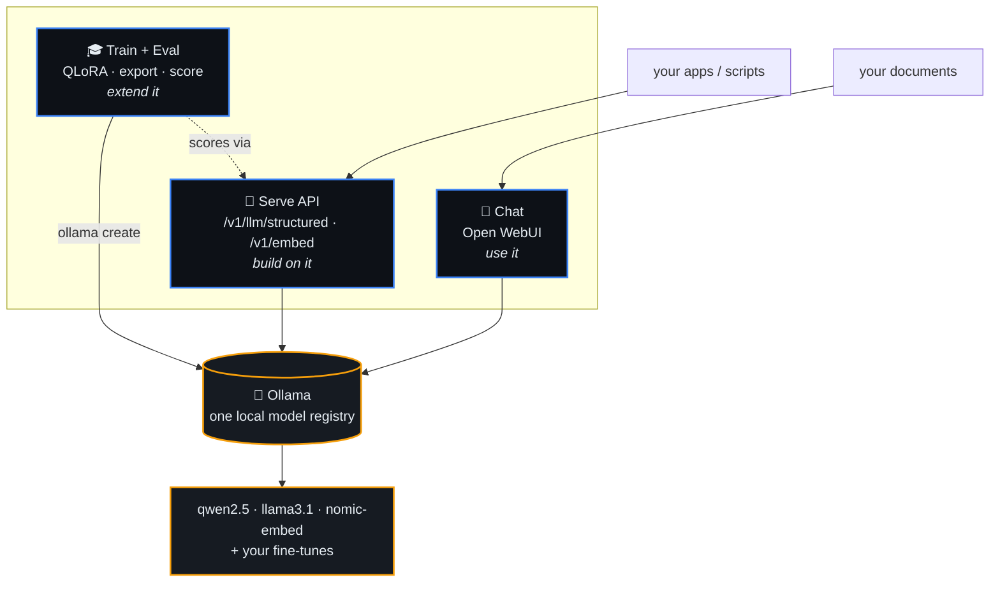
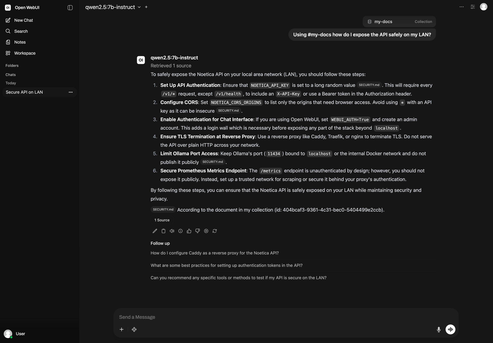

<div align="center">

# Noetica

**Your own local-AI stack. Chat with it, build on it, fine-tune it — one Ollama registry, no cloud, no secrets.**

[](https://github.com/chandlertee/noetica/actions/workflows/ci.yml)
[](LICENSE)
[](pyproject.toml)
[](https://github.com/astral-sh/ruff)
[](https://ollama.com)
[](#security)

Three front doors over one local model registry — and a closed loop between them.

</div>

---

Noetica is a self-hosted AI stack you run on your own hardware. It puts three
equal front doors over a single [Ollama](https://ollama.com) registry:

| Door | What | Surface |
|------|------|---------|
| 💬 **Chat** — *use it* | a private ChatGPT-style workbench | [Open WebUI](https://github.com/open-webui/open-webui) over your local models, with RAG over your own files |
| 🔌 **Serve** — *build on it* | a structured-output API | `POST /v1/llm/structured` (prompt + JSON Schema → validated JSON), `/v1/embed`, `/v1/health` |
| 🎓 **Train + eval** — *extend it* | fine-tune your own model | QLoRA → export to Ollama → it shows up in **chat and the API** → score it |

…and they form a **loop**: chat with local models → build apps on the structured
API → fine-tune your own model (FOSS) → export it back to Ollama → it appears in
chat *and* the API → evaluate → repeat. No cloud. No API keys. Nothing leaves your box.

## Architecture



Everything in the loop runs locally. Training can borrow a GPU (or Colab), but
**inference never leaves your machine**.

## Chat workbench

<div align="center">
  
  <br><sub>Open WebUI on a local <code>qwen2.5</code>, answering from your own document collection — fully local, with sources.</sub>
</div>

## 60-second quickstart

```sh
git clone https://github.com/chandlertee/noetica && cd noetica

# 1. Make sure Ollama has a model (laptop / macOS path):
ollama pull qwen2.5:7b-instruct nomic-embed-text

# 2. Bring up chat + the API (auto-picks cpu/gpu profile for your host):
./bin/up

# 3. Open the doors:
open http://localhost:3000          # 💬 chat (start here)
curl localhost:8001/v1/health       # 🔌 API
```

Ask the API for structured JSON:

```sh
curl -X POST localhost:8001/v1/llm/structured -H 'Content-Type: application/json' -d '{
  "prompt": "Describe the film Arrival (2016).",
  "response_schema": {
    "type": "object",
    "properties": {"title": {"type":"string"}, "year": {"type":"integer"}, "director": {"type":"string"}},
    "required": ["title", "year"]
  }
}'
```

No Docker? Run the API natively: `uv sync && uv run noetica serve` (then `noetica health`).

## The loop, end to end

```sh
# build on it — two endpoints compose into local RAG
python examples/rag_local.py "How do I expose the API safely?"

# extend it — fine-tune, export to Ollama, then it's in chat AND the API
python -m noetica.train.data validate examples/data/sample_chat.jsonl
python -m noetica.train.finetune --config noetica/train/configs/qwen2.5-7b.yaml   # GPU/Colab
python -m noetica.train.export_ollama --gguf my-model.Q4_K_M.gguf --name my-model

# evaluate — score models against golden cases
python -m noetica.eval.run --model my-model --model qwen2.5:7b-instruct
```

Full walkthroughs: [chat over your docs](examples/chat_projects.md) ·
[fine-tune → serve → chat → eval](examples/finetune_to_serve.md) ·
[all examples](examples/README.md).

## Features

| | |
|---|---|
| **Structured output** | JSON-Schema-driven generation with a repair-retry loop + server-side validation |
| **Embeddings + local RAG** | `/v1/embed` and an ~80-line [RAG example](examples/rag_local.py); built-in RAG in chat |
| **Observability** | structured JSON logs, per-request `X-Request-ID`, Prometheus `/metrics` |
| **Auth & CORS** | optional constant-time API key (`NOETICA_API_KEY`), configurable origins |
| **Fine-tuning** | Unsloth QLoRA recipe, dataset validation, Colab notebook for the no-GPU path |
| **Export to Ollama** | merge adapter → GGUF (llama.cpp) → quantize → Modelfile → `ollama create` |
| **Evals** | golden cases, `case × model` comparison table, deterministic CI gate |
| **Lifecycle-separated** | chat + serve install with **no torch/CUDA**; training lives behind `pip install .[train]` + a compose profile |
| **Tested & typed** | deterministic tests (Ollama mocked via `respx`), full type coverage, ruff + mypy in CI |

## Install profiles

```sh
uv sync                 # core: chat + serve + eval. No GPU, no torch.
uv sync --extra dev     # + test/lint/type tools
uv sync --extra train   # + QLoRA stack (torch/unsloth) — NVIDIA GPU
```

`./bin/up` picks a compose profile by host: `cpu` (laptop / macOS, Ollama native)
or `full` (containerized Ollama + GPU). Training is a separate one-shot profile.

## Security

Noetica defaults to a friendly, single-user **localhost** setup — and nothing
ever leaves your machine. Those defaults are convenient, not hardened. **Before
exposing anything on a network**, set `NOETICA_API_KEY`, set `WEBUI_AUTH=True`,
front it with TLS, and keep Ollama's port internal. The full checklist and threat
model are in [SECURITY.md](SECURITY.md).

## Built on (FOSS credits)

[Ollama](https://ollama.com) · [Open WebUI](https://github.com/open-webui/open-webui) ·
[FastAPI](https://fastapi.tiangolo.com) · [Unsloth](https://github.com/unslothai/unsloth) ·
[TRL](https://github.com/huggingface/trl) / [PEFT](https://github.com/huggingface/peft) ·
[llama.cpp](https://github.com/ggerganov/llama.cpp) · [uv](https://github.com/astral-sh/uv) ·
[Ruff](https://github.com/astral-sh/ruff). All FOSS, all local.

## Roadmap

The next door is **`agents/`** — local agents & automation that consume the serve
API + Ollama, slotting in behind their own `[agents]` extra and compose profile.
See [ROADMAP.md](ROADMAP.md). (Not in v1.0.0 — v1 stays focused on the three doors.)

## Contributing

Issues and PRs welcome — keep it local, light, and FOSS. See
[CONTRIBUTING.md](CONTRIBUTING.md), [AGENTS.md](AGENTS.md) (for coding agents),
and the [Code of Conduct](CODE_OF_CONDUCT.md).

## License

[Apache-2.0](LICENSE).
